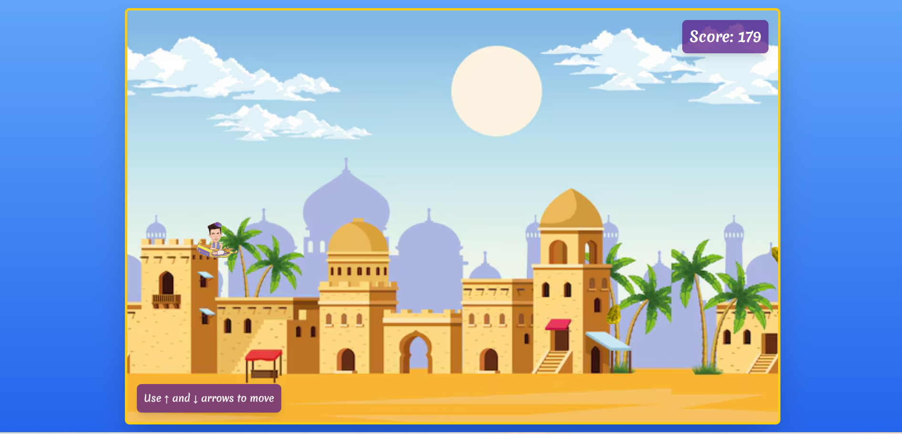
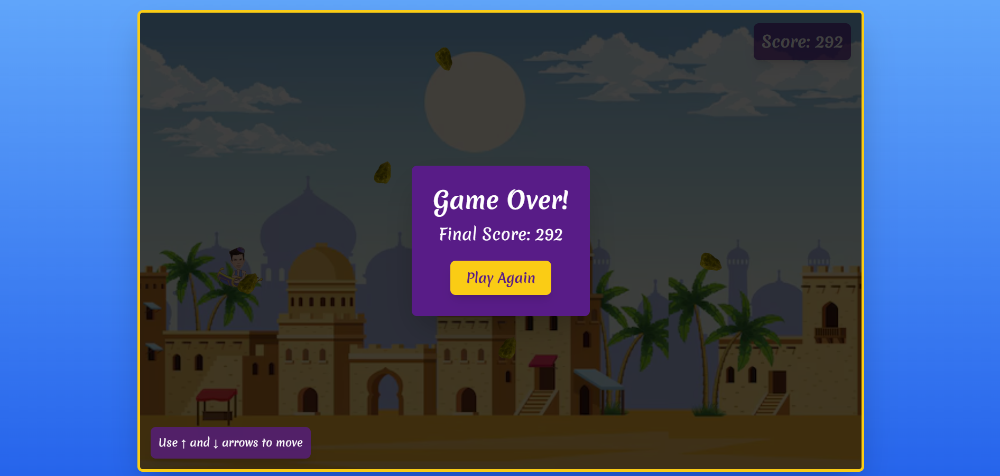

# [Aladdin Flying Carpet Game](https://allauddin-game.vercel.app/)

[](https://allauddin-game.vercel.app/)  
[](https://allauddin-game.vercel.app/)

---

## 🚀 Features

- 🪄 **Immersive Gameplay**: Navigate Aladdin on his flying carpet, dodge obstacles, and collect points.
- 🎵 **Dynamic Background Music**: Starts with any keypress for a fully immersive experience.
- ⚡ **Real-time Collision Detection**: Enhanced hitbox for a more realistic gaming challenge.
- 🎨 **Beautiful Visuals**: Animated sprites and dynamic backgrounds inspired by Arabian nights.

---

## 🛠️ Tech Stack

- **Frontend**: React.js, Tailwind CSS  
- **State Management**: React Hooks (`useState`, `useEffect`, `useRef`, `useCallback`)  
- **Audio Handling**: HTML5 Audio API for background music  
- **Animation**: CSS animations for sprites and transitions  

---

## 📝 Installation

Follow these steps to set up and run the game locally:

### 1️⃣ Clone the Repository

 ```bash
git clone https://github.com/uday778/Allauddin_game.git
cd allauddin_game
```

### 2️⃣ Install Dependencies
 ```bash
npm install
npm run dev
```
### 3️⃣ Run the Development Server
```bash
npm run dev
```

---


## How to Play

1.Use the Up Arrow (↑) to move the carpet up.
2.Use the Down Arrow (↓) to move the carpet down.
3.Dodge the obstacles and aim for the highest score!

---
## Contact
-Name: Uday Kumar
-Email: Uday33379@gmail.com
-GitHub:https://github.com/uday778
-LinkedIn: https://www.linkedin.com/in/uday778/

---
## 🤝Contributing
1.Fork the repository.
2.Create a new branch (git checkout -b feature-branch).
3.Commit your changes (git commit -m 'Add new feature').
4.Push to the branch (git push origin feature-branch).
5.Create a pull request.

---


